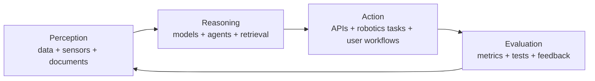

  

<h1 align="center">Hi, I'm Ranbir Kumar</h1>

  <strong>AI/ML Engineer | Robotics Engineer | Computer Vision Builder | Full-Stack Developer</strong>

  
  
  
  

I build practical intelligent systems across **RAG**, **robotics**, **computer vision**, **semantic search**, and **full-stack AI products**. I care about projects that move beyond model demos: clear architecture, usable interfaces, measurable behavior, and deployable systems.

---

## Mission Control

| Current Build Vector | What I Am Exploring |
|---|---|
| Autonomous field robotics | Decision-making agents under hazards, energy limits, and mission phases |
| Document intelligence | RAG, structured table QA, memory, and grounded answers |
| Computer vision | Medical imaging, smart agriculture, detection, and explainability |
| ML systems | Semantic caching, vector search, clustering, evaluation, and APIs |
| Product engineering | Frontend workflows, deployment, auth, storage, and user-facing AI tools |

---

## Tech Stack

<table>
  <tr>
    <td align="center"><strong>AI / ML</strong></td>
    <td align="center"><strong>Robotics / CV</strong></td>
    <td align="center"><strong>Full-Stack</strong></td>
    <td align="center"><strong>Tools</strong></td>
  </tr>
  <tr>
    <td>
      
      
      
      
    </td>
    <td>
      
      
      
      
    </td>
    <td>
      
      
      
      
      
    </td>
    <td>
      
      
      
      
    </td>
  </tr>
</table>

---

## Featured Systems

| Project | Stack | Why It Matters |
|---|---|---|
| [iORA DocQA](https://github.com/Ranbirkumar26/iora-docqa) | FastAPI, Next.js, Supabase, pgvector, DuckDB, LLMs | Full-stack document QA with direct-context answers, RAG, structured table queries, memory, auth, storage, Docker, and tests. |
| [FieldOpsEnv](https://github.com/Ranbirkumar26/fieldopsenv-openenv) | Python, FastAPI, Pydantic, agent evaluation | Autonomous field-robotics benchmark for evaluating decisions under hazards, energy limits, and mission stages. |
| [SemantiCache](https://github.com/Ranbirkumar26/SemantiCache) | Sentence Transformers, FAISS, GMM, FastAPI | Semantic search system with clustering and cache-aware retrieval for repeated query acceleration. |
| [Explainable Few-Shot](https://github.com/Ranbirkumar26/Explainable-Fewshot) | PyTorch, ResNet-18, Prototypical Networks, Grad-CAM | Few-shot medical image classification for low-data settings with explainable visual reasoning. |
| [Agri Monitor](https://github.com/Ranbirkumar26/agri-monitor) | Flask, OpenCV, YOLO, ResNet, scikit-learn | Precision agriculture dashboard for leaf disease detection, weed detection, soil health prediction, and field mapping. |
| [CraveConnect](https://github.com/Ranbirkumar26/craveconnect) | Flask, scikit-learn, product analytics | Customer upgrade prediction with explainability, CSV workflows, and segment-based recommendations. |

---

## GitHub Telemetry

  
  

  

---

## Engineering Loop

---

## Connect

  
  
  

  <em>Building systems that sense, reason, act, and improve.</em>

